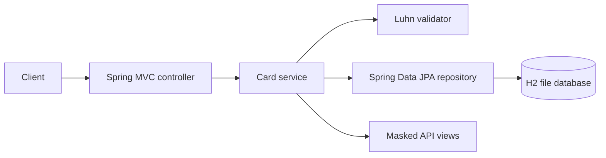
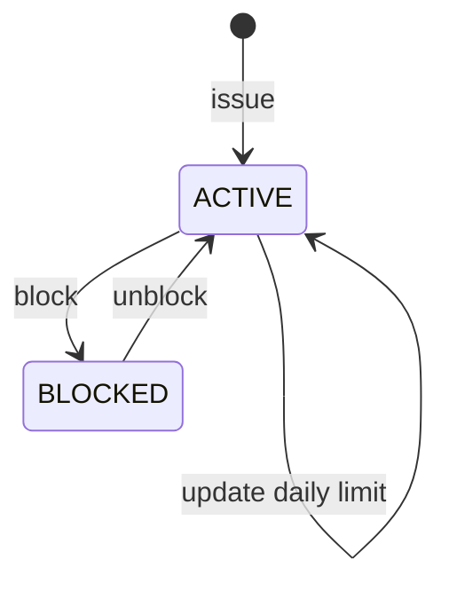

# CardLifecycleApi

CardLifecycleApi is a Java 17 and Spring Boot service for a demo card lifecycle. It issues Luhn-valid test PANs, stores only a PAN last-four value and peppered SHA-256 hash, maintains a daily spending allowance, and supports block and unblock operations.

It uses an H2 file database through Spring Data JPA, so cards and their current daily spend survive an application restart. This is a portfolio project, not a payment processor.

## What it does

| Capability | Status |
| --- | --- |
| Issue Luhn-valid demo cards and return masked PANs | Implemented |
| Persist cards and daily authorization state with H2/JPA | Implemented |
| Block and unblock cards | Implemented |
| Set a positive daily limit | Implemented |
| Authorize spending within the remaining daily limit, with replay protection | Implemented |
| Review an append-only authorization ledger | Implemented |
| Validate a submitted PAN without returning it | Implemented |
| Real issuer, network, settlement, or reversal processing | Not included |
| PCI DSS controls, real payment authentication, issuer or network integration | Not included |

## Architecture



## Lifecycle



## Run locally

```bash
./mvnw spring-boot:run
```

On Windows:

```powershell
.\mvnw.cmd spring-boot:run
```

The API listens on port `8082`. Run the verification suite with `./mvnw test`.

## API

| Method | Path | Description |
| --- | --- | --- |
| `POST` | `/api/cards` | Issue a card |
| `GET` | `/api/cards` | List cards |
| `GET` | `/api/cards/{cardId}` | Get a card |
| `POST` | `/api/cards/{cardId}/block` | Block a card |
| `POST` | `/api/cards/{cardId}/unblock` | Unblock a card |
| `POST` | `/api/cards/{cardId}/limit` | Change the daily limit |
| `POST` | `/api/cards/{cardId}/authorize` | Record an authorization |
| `GET` | `/api/cards/{cardId}/authorizations` | List authorization ledger entries |
| `POST` | `/api/cards/validate` | Validate a PAN with Luhn |
| `GET` | `/api/cards/health` | Service health |

## Example authorization

```bash
curl -X POST http://localhost:8082/api/cards/CARD-XXXXXXXX/authorize \
  -H "X-Api-Key: local-development-api-key" \
  -H "Idempotency-Key: 7e8bb31e-9e2e-4a17-9f64-2f9cd6e6dcd2" \
  -H "Content-Type: application/json" \
  -d '{ "amount": 125.50 }'
```

An accepted authorization returns its amount, `spentToday`, `availableDailyLimit`, and `APPROVED`. A blocked card returns HTTP 409 with `CARD_BLOCKED`; an amount above the remaining daily limit returns HTTP 409 with `INSUFFICIENT_LIMIT`. The same `Idempotency-Key` replays the original response without adding another ledger row.

## Security boundaries

- API responses never include a full PAN. The card table stores a last-four value plus a SHA-256 hash of the generated PAN with `card.pan-pepper`; it does not map or write a full PAN field.
- `POST /api/cards/validate` accepts a PAN only to perform Luhn validation and returns its last four digits. It does not persist the submitted PAN.
- All state-changing card endpoints require `X-Api-Key`. Configure `CARD_API_KEY` and `CARD_PAN_PEPPER` outside the repository for any non-local environment.
- Responses receive `Cache-Control: no-store`, anti-framing, MIME-sniffing, referrer, and restrictive content-security headers.
- Request payloads validate required text and positive, two-decimal monetary amounts.
- This project is **not PCI DSS compliant**. A SHA-256 hash and API key check do not make it a payment processor or replace PCI DSS-approved tokenization, encryption, key management, access controls, or audit requirements.

## License

MIT, see [LICENSE](LICENSE).
