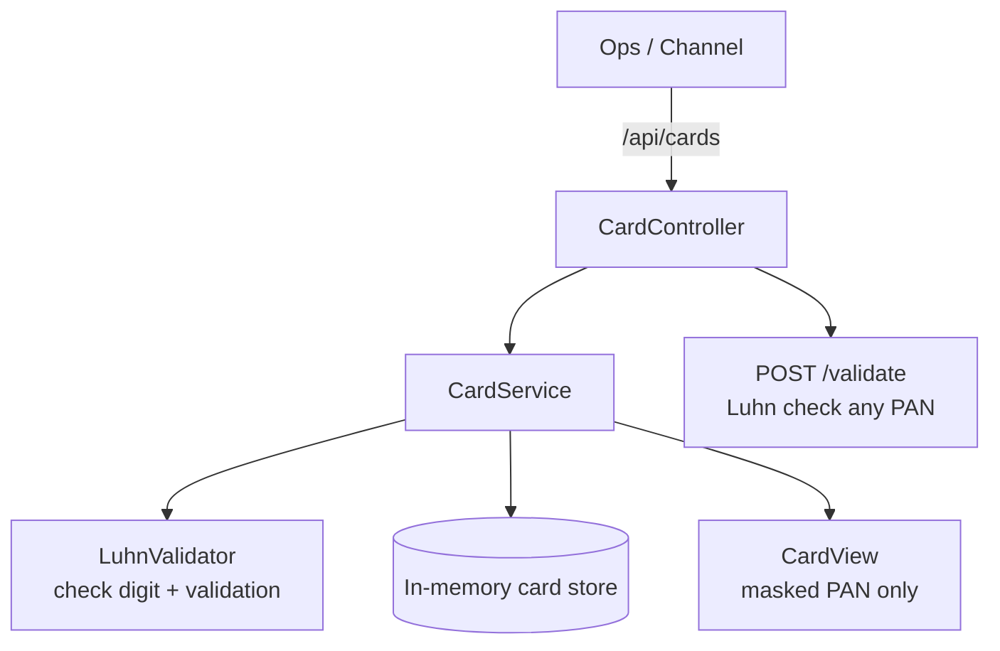
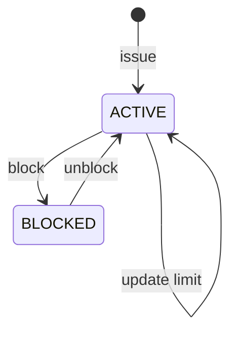

# Card Management Service

Card issuance and lifecycle microservice: issue cards with a Luhn-valid PAN, mask the number, manage daily limits, and block / unblock.

Built with **Java 17** and **Spring Boot 3**. In-memory storage keeps it runnable with zero infrastructure.

## Architecture



## Card lifecycle



## Features

- Issue cards with a generated **Luhn-valid** PAN and expiry
- PAN is never returned in full; responses expose a masked PAN only
- Standalone Luhn validation endpoint
- Daily limit updates
- Block / unblock lifecycle

## Quick start

```bash
./mvnw spring-boot:run      # Linux / macOS
mvnw.cmd spring-boot:run    # Windows
```

Run tests:

```bash
./mvnw test
```

## Example flow

```bash
# Issue a card
curl -s -X POST http://localhost:8082/api/cards \
  -H "Content-Type: application/json" \
  -d '{ "cardholderName": "Ada Lovelace", "dailyLimit": 8000 }'

# Validate a PAN with the Luhn algorithm
curl -s -X POST http://localhost:8082/api/cards/validate \
  -H "Content-Type: application/json" \
  -d '{ "pan": "4111111111111111" }'

# Block / unblock (use the cardId from issue)
curl -s -X POST http://localhost:8082/api/cards/CARD-XXXXXXXX/block
curl -s -X POST http://localhost:8082/api/cards/CARD-XXXXXXXX/unblock
```

## API

| Method | Path | Description |
|--------|------|-------------|
| `POST` | `/api/cards` | Issue a card |
| `GET` | `/api/cards` | List cards |
| `GET` | `/api/cards/{id}` | Get a card |
| `POST` | `/api/cards/{id}/block` | Block a card |
| `POST` | `/api/cards/{id}/unblock` | Unblock a card |
| `POST` | `/api/cards/{id}/limit` | Update daily limit |
| `POST` | `/api/cards/validate` | Luhn-validate a PAN |
| `GET` | `/api/cards/health` | Health check |

## Design notes

- PANs are generated on a demo BIN and completed with a computed Luhn check digit
- Only masked PANs (`**** **** **** 1234`) leave the service
- Storage is in-memory and resets on restart

## License

MIT — see [LICENSE](LICENSE).
