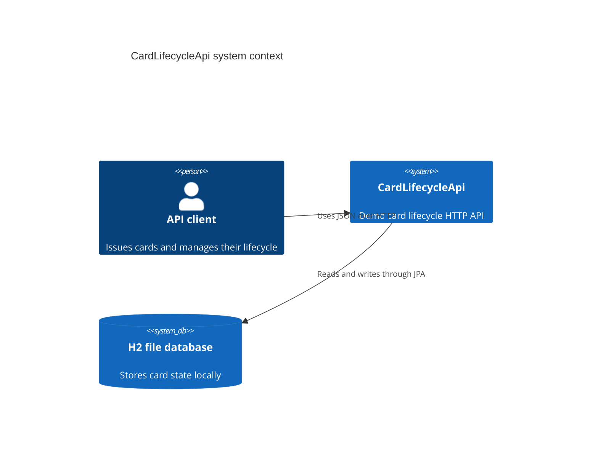
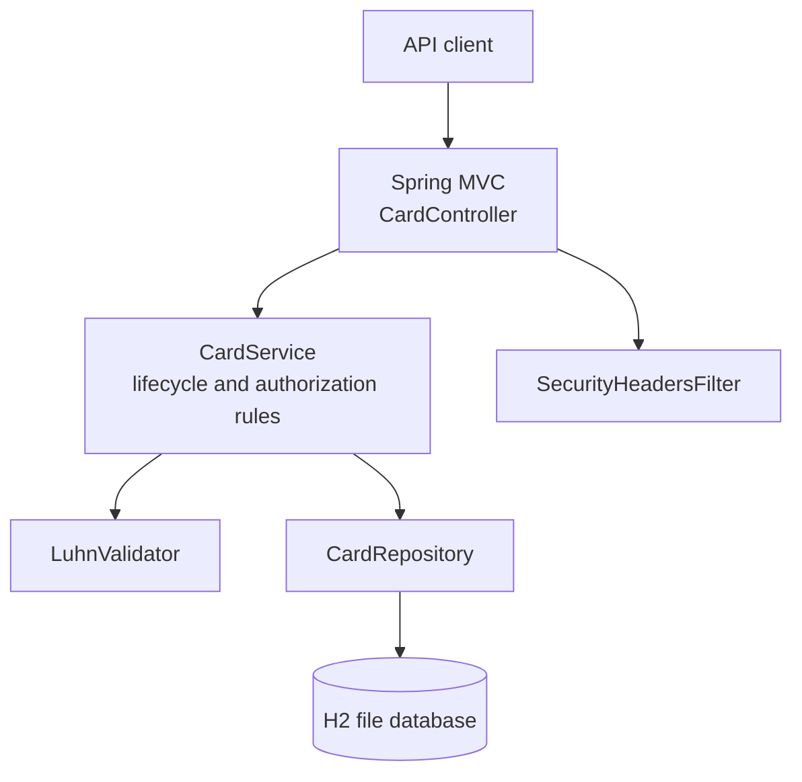

# Architecture

## Scope

CardLifecycleApi is a single Spring Boot application. It models demo cards and their daily authorization allowance. The application does not connect to an issuer, card network, payment gateway, or identity provider.

## C4-style context

## Container view

## Authorization rule

For each card, the persisted state holds a daily limit, amount spent today, and the date that spend applies to. When a card is observed on a new calendar date, the service resets and persists its daily spend. Authorizations append a ledger entry with the amount, result code, remaining limit, and timestamp. A client-supplied idempotency key persists the response so a retry does not create another authorization.

The `@Version` column makes conflicting card-row updates fail with an optimistic-lock exception. The HTTP API maps that exception to HTTP 409, so callers can retry with the same idempotency key.

## Data protection boundary

The API projects `CardView` and `AuthorizationView` records rather than serializing the entity. The card entity stores a PAN last-four value and a SHA-256 hash combined with a configured pepper; it has no mapped full-PAN field. The validation endpoint uses a request-body PAN for Luhn checking only and does not persist it. This is still not PCI DSS compliant.

## Verification

The test suite includes algorithm tests, service unit tests, MockMvc endpoint tests, and a restart test against an H2 file database. The authorization tests cover successful spending, blocked cards, and over-limit declines.
